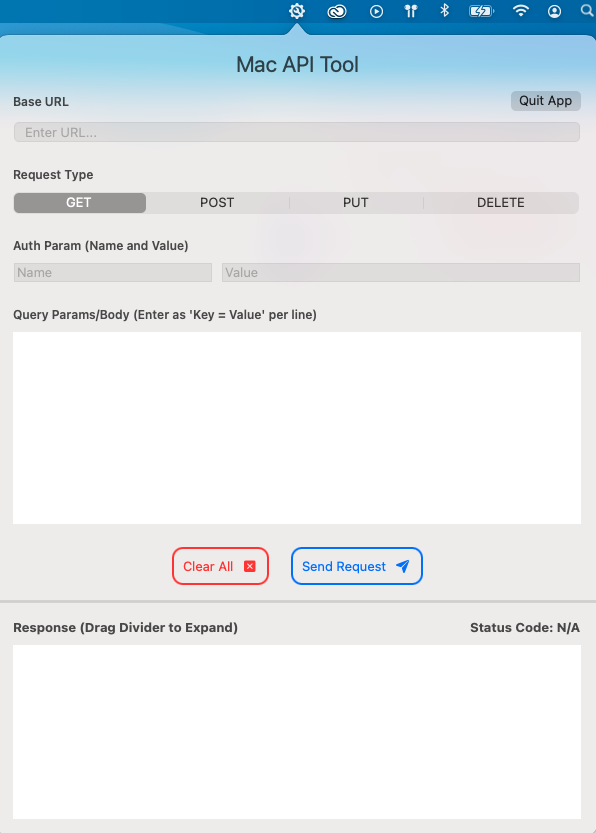

# Mac API Tool
The Mac API Tool is a lightweight menu bar application designed to improve the workflow productivity of developers. It provides users with a status bar icon that can be used to access an intuitive Swift user interface for exploring API endpoints and performing simple requests. This easy accessibility eliminates the time spent for launching another API explorer application and/or opening a web browser.

## The Mac API Tool UI

## Compatibility
This application has been intended for use on Mac’s running OS 11.0 and higher. It was built in Xcode 12.2.

## Installation Instructions
1. Download the latest release from [here](https://github.com/sjgutta/mac-api-tool/releases/latest/download/Mac-api-tool.app.zip).
2. Drag the downloaded application from your Downloads folder into your Applications folder.
3. You are now ready to start the application and use it!

## Uninstalling The Application (VERY IMPORTANT)
If the application is running, you may experience an error when uninstalling but this is easily fixed with the following steps.
1. Open the application using its menu bar icon.
2. Press the “Quit App” button to terminate all processes relate to the application.
3. Now, you should be able to remove the application from your Applications folder for uninstalling. The icon will no longer show up on the menu bar.
4. If all else fails, you are also able to kill any relate processes from the “Activity Monitor.”

## Features
1. QUIT APP BUTTON: This is a very important feature. Users can click this button to quit the app process and remove it from the toolbar. However, the only true use case is when uninstalling the app. Users must press this first to stop the app process, so that it may be moved from the Applications folder to Trash.
2. Users enter their target url at the top of the application. Error handling warns when no url has been entered.
3. Users can make GET, POST, PUT, and DELETE requests through the tool. These are the 4 main operations for REST APIs.
4. The interface provides a text area for easily entering query parameters. Each line includes a key value pair separated by an equals sign. This interface may be upgraded in a future release.
5. The text area for query parameters serves as the request body for POST, PUT, and DELETE requests.
6. There is a separate place to enter the auth parameter and value for an API call. This would be a great place to enter the API key or an access token.
7. There is a button to send a request and a button to clear the values in all fields at once.
8. The response area pretty prints the request’s response data and can be easily copy and pasted. The status code is also displayed. The code will be red if it represents an error occurring.
9. The divider between the request info and response areas can be moved to expand either area for better viewing.

## New Features and Issues
If any issues come up with using the application, feel free to create an issue on this repository to have it addressed. The same can be done for requesting new features. I will aim to address these as soon as I can. New features and fixes will be provided in future releases.
